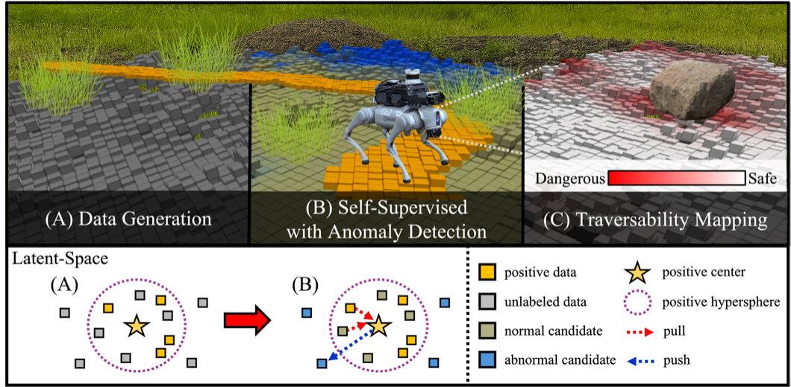
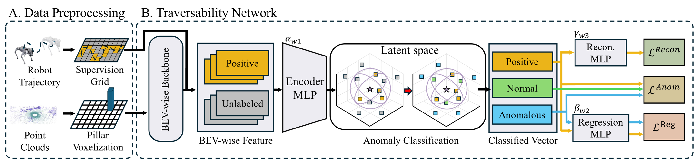

<div align="center">

# GSAT

### Geometric Traversability Estimation using Self-supervised Learning with Anomaly Detection for Diverse Terrains

[](https://sparolab.github.io/research/gsat/)
[](https://arxiv.org/abs/2603.07480)
[](https://www.youtube.com/watch?v=1ULi2VL8g1o)
[](#)

**Dongjin Cho, Miryeong Park, Juhui Lee, Geonmo Yang, Younggun Cho**

[Spatial AI and Robotics Lab (SPARO)](https://sparolab.github.io/), Inha University



</div>

---

## Overview

GSAT learns robot-specific traversability from LiDAR point clouds — without human supervision. It builds a positive hypersphere in latent space using anomaly detection, addressing the positive-only learning problem.

<div align="center">



*Overview of the GSAT framework*

</div>

---


## Getting Started

### 0. Environment Set up (Docker)

```bash
cd docker

# Build
docker compose -f docker-compose-gui-nvidia.yaml build

# Start container
docker compose -f docker-compose-gui-nvidia.yaml up -d

# Open shell
docker exec -it gsat /bin/bash
```

Inside the container, build the ROS workspace once:

```bash
cd ~/gsat_ws
catkin build
echo "source ~/gsat_ws/devel/setup.bash" >> ~/.bashrc
source ~/.bashrc
```

Build the CUDA voxelization op:

```bash
cd ~/gsat_ws/src/GSAT_Traversability/gsat
python3 setup.py build_ext --inplace
```

---

### 1. Data Collection (ROS)

See [`gsat_ros/README.md`](gsat_ros/README.md) for topic configuration and output format.

```bash
# Terminal 1 — play rosbag
rosbag play <your_bag>.bag

# Terminal 2 — run collection node
roslaunch gsat_ros data_collection.launch
```

Output:

```
collect_data/gazebo/hill/original/
├── supervision.csv          # pose + Travel_label
└── lidar/
    └── <timestamp>.bin      # float32 x, y, z, intensity
```

---

### 2. Preprocess for Train Data

#### Step 1. Train Data Preprocess

Edit `config/data_preprocess.yaml` (set `data_folder` and `output_folder`), then run:

```bash
cd ~/gsat_ws/src/GSAT_Traversability/gsat/data_tools
python3 data_preprocess.py --key {data_name}
```

Output:

```
collect_data/gazebo/hill/process/
├── point/     # Leveled point clouds (*.bin)
└── label/     # Future trajectory + Travel_label (*.bin, K×4)
```

#### Step 2. Dataset Split

Edit `config/data_split.yaml` (set `root_dir`, `preprocess_dir`, `save_dir`, and split ratios), then run:

```bash
python3 data_split.py --key {data_name}
```

Output:

```
collect_data/gazebo/hill/dataset/
├── train/  point/  label/
├── val/    point/  label/
└── test/   point/  label/
```

---

### 3. Training

Edit `gsat/config/train.yaml` (set `dataset_dir` and `save_dir`), then run:

```bash
cd ~/gsat_ws/src/GSAT_Traversability/gsat
python3 train.py --key {data_name}
```

Checkpoints are saved as `epoch_*.pth` and `best_model_*.pth` under `save_dir`.

---

## Demo

Two demos are available:
- **Anomaly Classification** — inference the anomalous(dissimilar positive samples), normal sample(similar positive sample).
- **Traversability Navigation** — navigate using predicted traversability map.

<div align="center">


*Anomaly classification Demo*


*Traversability-guided navigation Demo*

</div>

> 🚧 **Demo code coming soon...........**

---

## Citation

If you find this work useful, please cite:

```bibtex
@inproceedings{gsat2026,
  title     = {GSAT: Geometric Traversability Estimation using Self-supervised Learning with Anomaly Detection for Diverse Terrains},
  author    = {Cho, Dongjin and Park, Miryeong and Lee, Juhui and Yang, Geonmo and Cho, Younggun},
  booktitle = {IEEE International Conference on Robotics and Automation (ICRA)},
  year      = {2026}
}
```
